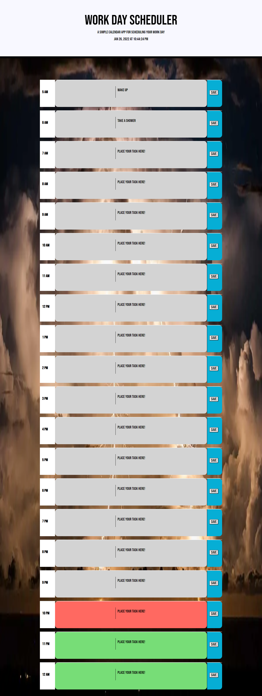

# Daily-Planner-of-The-Dead

## Basic jest of the task
Create a simple calendar application that allows a user to save events for each hour of the day by modifying starter code.

## User Story

```
AS AN employee with a busy schedule
I WANT to add important events to a daily planner
SO THAT I can manage my time effectively
```


## Acceptance Criteria

```
GIVEN I am using a daily planner to create a schedule
WHEN I open the planner
THEN the current day is displayed at the top of the calendar
WHEN I scroll down
THEN I am presented with timeblcks for standard business hours
WHEN I view the timeblocks for that day
THEN each timeblock is color coded to indicate whether is is in the past, present, or future
WHEN I click into a timeblock
THEN I can enter an event
WHEN I click the save button for that timeblock
THEN the text for that event is saved in local storage
WHEN I refresh the page
THEN the saved events persist
```

## Functionality

The planner works as thus:
>1. There is a dynamic time and date above the planner sections that updates accordingly
>2. Each section of the planner will automatically update itself based on the time
>3. Any tasks that are saved to the planner will be saved and stored to the planner until the user changes the task

The user inputs their task in the text area of the given time sections. Once written, the user will hit the save button so that their task will remain in the given time slot until the user deletes it. This is only a basic planner, so there is no dynamic features that saves the task for a certain time period using a calendar.

The layout of the application:


### Notes

>1. Using [Moment.js](https://momentjs.com/) to work with date and time
>2. CSS is powered by JQuery
>3. HTML is dynamically updated

### Link to deployed application: https://lawrencesb24.github.io/Daily-Planner-of-The-Dead/
## Additional note: So while the user can type in their task into the time-block, there is still an error with saving the task so that when the user re-loads the page then the task they had saved is still there until they delete the task, type in another, and save the new task. Currently working on this issue and will be fixed soon.
